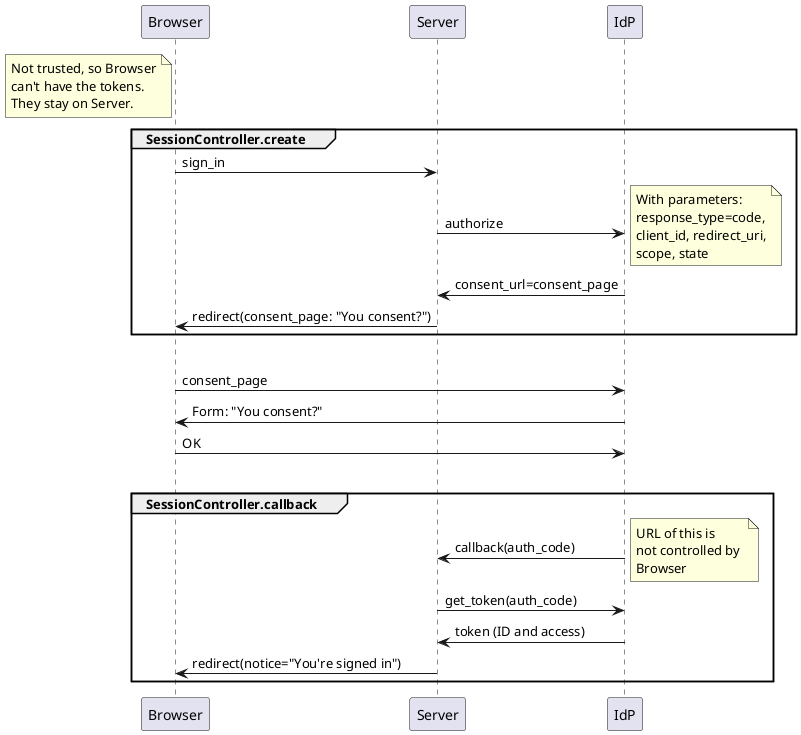

# Auth Code Flow

https://plantuml.nowtech.io/svg/VLBRIiD047tVhnZwqXPgFw1G1HL151KlY4zXtOp9Ojm9inCbqeztDabhh2Xa8SpPd5kcjYpU-Te6WMEcZuXi0Wb2XIy2zB8R0boHW70J1VC5H1eXpeQfG6dV4QJKGwyOuX8KkI-nXIYs1GfmX_oEl3GOSaWQfXw9z-2FqNb-Oqp1rDIAnkWfd50GfgfI5iTebM8m0GU70mEi8FeYP3wOOQ2GCkdSDb8I-q_i4x8lIZ6FNafGLVk6WXnNXZ7M529cqjQuTfJZ0eohF0R9l2Pdp3sZawnXhqXqLEiDpQXkTicIuDYIIumXVLEjj--rBN3aSPjajLEOZM-kOF94pPReQ39FOcQpsOmhw7F-41YSVBEV4R_ja_tckBxekFzitrRLitMlluCEm2oLdQNsvkEs0HvkBzDQIUaZwACJXPEJdZg7vpODjykrQtJ_PnOeMRTeOwLzDzq5c9sVWbKUwvm6cV_VkOfvX-lKpvInsoKrvKDV-1S0

https://plantuml.com/en/sequence-diagram
